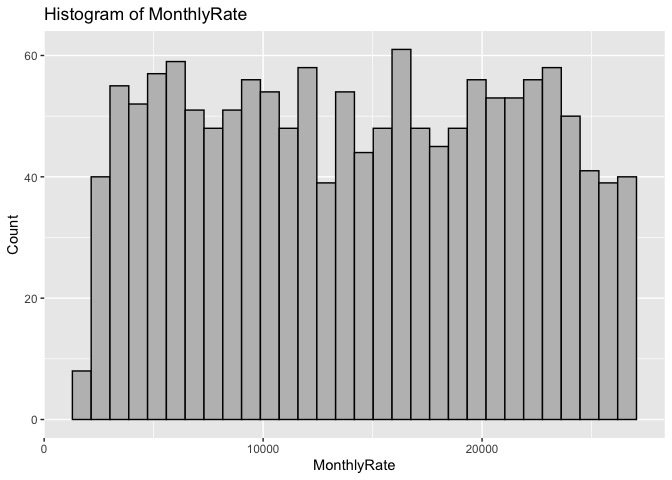
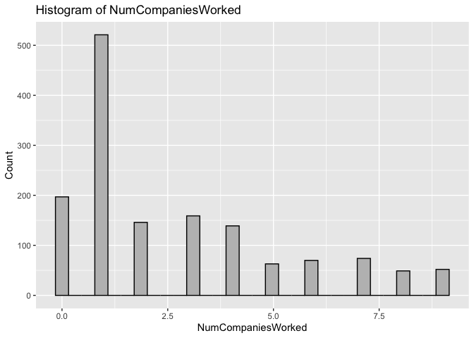
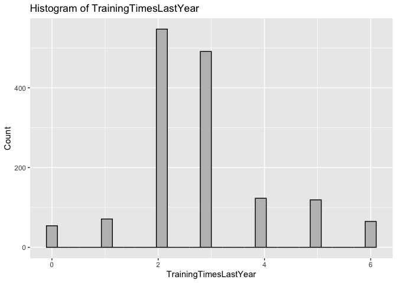
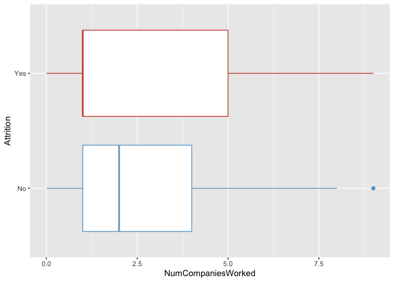
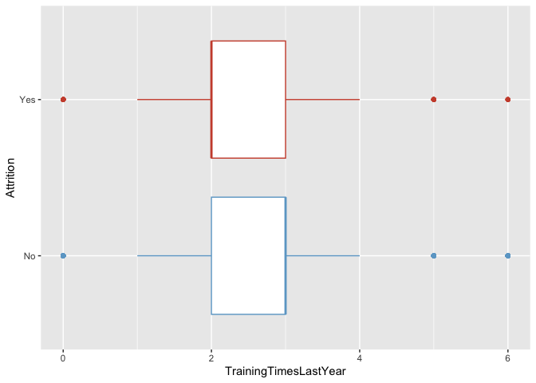

Project: Employee Attrition
================
Gabriel Fernandez, Jessica Tappi, Olympia Lala, and Tenzin Bajracharya
12/06/2022

``` r
# Set default options for code chunks
knitr::opts_chunk$set(
  echo = FALSE,          # Display R code and its output
  comment=NA,           # Suppress code comments in output
  include = TRUE,      # Suppress code outputs
  warning = FALSE,      # Suppress warning messages
  fig.align='center',   # Align figures in the center
  eval = TRUE           # Evaluate R code
)
```

# Dataset

[IBM HR Analytics Employee Attrition & Performance: IBM HR Analytics
Employee Attrition &
Performance](https://www.kaggle.com/datasets/pavansubhasht/ibm-hr-analytics-attrition-dataset)

Below is the data description along with the link to variable
descriptions. Data description:

This is a fictional dataset created by IBM data scientists. - Kaggle
usability score: 8.82 - License: Open Database License (ODbL) (users can
freely share, modify, and use a database while maintaining this same
freedom for others.) - Number of observations: 1470 - Number of columns:
35 - [Link:
Data_Variable_Dictionary](https://docs.google.com/spreadsheets/d/13k0-IkYwHR9Em9-OyjJcwEblWxX_xvtT0LHyk4QZSFM/edit)

Which factors lead to employee attrition? How many employees are more
likely to leave their jobs? Our target variable is attrition

Employee attrition prediction is a classification problem. We plan to
use classification algorithms and compare the performance of the
following models to predict attrition.

- Logistic regression
- KNN
- Decision tree
- Bagging
- Random forest

# Exploratory data analysis

### Columns names

    Age
    Attrition
    BusinessTravel
    DailyRate
    Department
    DistanceFromHome
    Education
    EducationField
    EmployeeCount
    EmployeeNumber
    EnvironmentSatisfaction
    Gender
    HourlyRate
    JobInvolvement
    JobLevel
    JobRole
    JobSatisfaction
    MaritalStatus
    MonthlyIncome
    MonthlyRate
    NumCompaniesWorked
    Over18
    OverTime
    PercentSalaryHike
    PerformanceRating
    RelationshipSatisfaction
    StandardHours
    StockOptionLevel
    TotalWorkingYears
    TrainingTimesLastYear
    WorkLifeBalance
    YearsAtCompany
    YearsInCurrentRole
    YearsSinceLastPromotion
    YearsWithCurrManager

## Univariate analysis

### Numerical variables




### Observations

- Remove “EmployeeCount.” All observations have the same value (1)

- Remove “StandardHours.” All observations have the same value (80)

- Remove “EmployeeNumber” because is a unique Id that will not add any
  additional information

#### After exploring the histogram for the following variables, we realized that they are factors, not numerical.

- Education
- EnvironmentSatisfaction
- JobInvolvement
- JobSatisfaction
- PerformanceRating
- RelationshipSatisfaction
- WorkLifeBalance
- StockOptionLevel

The factor levels were provided within the original source for all
variables except for “StockOptionLevel.” From the dataset link, we can
find the name of the levels. [Check dataset
source](https://www.kaggle.com/datasets/pavansubhasht/ibm-hr-analytics-attrition-dataset)

For “StockOptionLevel”, we only converted the variable to a factor with
the unique levels as the following factors(0, 1, 2, 3). It seems these
are the level names that IBM uses for its option levels. [Stock Option
Levels](https://www.levels.fyi/companies/ibm/salaries/recruiter)


### Categorical variables

### Observations

- The response variable is unbalanced: 237 observations have “Yes” and
  1233 have “No”

- “Yes” is coded as 1 and “No” as 0

- “Over18” has only 1 value. All the employees are older than 18.
  Therefore, we have to drop the redundant column.

## Bivariate analysis

### Correlation between numerical variables


    Department =  6 
    DistanceFromHome =  5 

### Observations

- “Department” and “MonthlyIncome” are highly correlated. Some
  departments may be paid more than the others

- “DistanceFromHome” and “JobLevel” are highly correlated

### Numerical variables vs response


\### Observations:

- Four out of fifteen variables do not show obvious differences between
  the median attrition, regardless of the condition: (HourlyRate,
  TrainingTimesLastYear, YearsSinceLastPromotion, PercentSalaryHike)

- For the rest of the numerical variables, the median attrition differs
  between the classes

### Factor variables vs. response


\### Observations:

- Most factors show an imbalance between the classes

- Employees with Bachelor’s degree as their highest education level are
  more likely to leave the company, whereas employees with Doctorate
  degree are less likely to leave the company

- Single employees are more likely to leave the company

## Check for null values

                         Age                Attrition           BusinessTravel 
                           0                        0                        0 
                   DailyRate               Department         DistanceFromHome 
                           0                        0                        0 
                   Education           EducationField  EnvironmentSatisfaction 
                           0                        0                        0 
                      Gender               HourlyRate           JobInvolvement 
                           0                        0                        0 
                    JobLevel                  JobRole          JobSatisfaction 
                           0                        0                        0 
               MaritalStatus            MonthlyIncome              MonthlyRate 
                           0                        0                        0 
          NumCompaniesWorked                 OverTime        PercentSalaryHike 
                           0                        0                        0 
           PerformanceRating RelationshipSatisfaction         StockOptionLevel 
                           0                        0                        0 
           TotalWorkingYears    TrainingTimesLastYear          WorkLifeBalance 
                           0                        0                        0 
              YearsAtCompany       YearsInCurrentRole  YearsSinceLastPromotion 
                           0                        0                        0 
        YearsWithCurrManager 
                           0 

## Check for duplicates

    Duplicate values: 0

### Observations

- There are no missing values.
- There are no duplicates.

## Check for outliers

The following variables have outliers:

    - MonthlyIncome
    - NumCompaniesWorked
    - TotalWorkingYears
    - TrainingTimesLastYear
    - YearsAtCompany
    - YearsInCurrentRole
    - YearsSinceLastPromotion
    - YearsWithCurrManager

     MonthlyIncome   NumCompaniesWorked TotalWorkingYears TrainingTimesLastYear
     Min.   : 1009   Min.   :0.000      Min.   : 0.00     Min.   :0.000        
     1st Qu.: 2911   1st Qu.:1.000      1st Qu.: 6.00     1st Qu.:2.000        
     Median : 4919   Median :2.000      Median :10.00     Median :3.000        
     Mean   : 6503   Mean   :2.693      Mean   :11.28     Mean   :2.799        
     3rd Qu.: 8379   3rd Qu.:4.000      3rd Qu.:15.00     3rd Qu.:3.000        
     Max.   :19999   Max.   :9.000      Max.   :40.00     Max.   :6.000        
     YearsAtCompany   YearsInCurrentRole YearsSinceLastPromotion
     Min.   : 0.000   Min.   : 0.000     Min.   : 0.000         
     1st Qu.: 3.000   1st Qu.: 2.000     1st Qu.: 0.000         
     Median : 5.000   Median : 3.000     Median : 1.000         
     Mean   : 7.008   Mean   : 4.229     Mean   : 2.188         
     3rd Qu.: 9.000   3rd Qu.: 7.000     3rd Qu.: 3.000         
     Max.   :40.000   Max.   :18.000     Max.   :15.000         
     YearsWithCurrManager
     Min.   : 0.000      
     1st Qu.: 2.000      
     Median : 3.000      
     Mean   : 4.123      
     3rd Qu.: 7.000      
     Max.   :17.000      

### Observations

- Outliers do not look unreasonable

## Check if the data is balanced or imbalanced


- Here, the data is unbalanced: 237 (\~16%) employees leave the company,
  whereas 1233 (\~84%) stay at their workplace

## Data preprocessing for logistic regression and KNN

# Datasets after EDA and preprocessing

# Final dataset after EDA. Use this dataset for decision trees, bagging, and random forest.

- Multicollinearity does not affect tree-based models.

<!-- -->

    Dataset for the tree-based models shape = ( 1470 , 31 )


## Using oversampling to balance the training data for dataset without the dummy variables

      Attrition   n
    1        No 892
    2       Yes 930


# Final dataset for logistic regression and KNN. For this dataset, we created dummy variables for the factor variables.

    Dataset for logistic regression and KNN shape = ( 1470 , 71 )

### - Train and test the hold-out dataset with the dataset containing dummy variables used for logistic regression and KNN


## Using oversampling to balance the training data for the dataset containing dummy variables


# Model 1: Logistic Regression

\###- Fitting all the data to the logistic model to find variables with
high VIF.

\###- We need to drop the linearly dependent variables below and refit
the model:

     [1] "department_sales"                    "education_doctor"                   
     [3] "environment_satisfaction_very_high"  "job_involvement_very_high"          
     [5] "job_satisfaction_very_high"          "performance_rating_low"             
     [7] "performance_rating_good"             "performance_rating_outstanding"     
     [9] "relationship_satisfaction_very_high" "stock_option_level_3"               
    [11] "work_life_balance_best"             

### - Fit the entire dataset to the logistic model after dropping high linearly dependent variables

### - These variables have a VIF \> 5

    business_travel_travel_frequently business_travel_travel_rarely department_human_resources department_research_development education_below_college education_college education_bachelor education_master education_field_life_sciences education_field_medical job_involvement_high job_role_healthcare_representative job_role_human_resources job_role_laboratory_technician job_role_manager job_role_manufacturing_director job_role_research_scientist marital_status_single stock_option_level_0 stock_option_level_1 stock_option_level_2 job_level monthly_income total_working_years years_at_company 

### - These variables have a VIF \> 10

    department_human_resources department_research_development education_bachelor job_role_human_resources job_role_laboratory_technician job_role_manufacturing_director job_role_research_scientist stock_option_level_0 job_level monthly_income  

- We chose a VIF = 10 as a threshold to avoid removing too many
  significant variables from the dataset

<!-- -->

    Dataset for logistic regression and KNN shape = ( 1822 , 60 )

### - Fit final logistic regression

### - Train and test the hold-out dataset after removing all the high VIF variables


    Call:
    glm(formula = attrition_yes ~ ., family = binomial, data = final_EA_data_log)

    Deviance Residuals: 
        Min       1Q   Median       3Q      Max  
    -3.0082  -0.3647   0.1070   0.3933   3.8303  

    Coefficients:
                                         Estimate Std. Error z value Pr(>|z|)    
    (Intercept)                        -6.685e+00  1.525e+00  -4.383 1.17e-05 ***
    business_travel_travel_frequently   3.563e+00  4.570e-01   7.797 6.33e-15 ***
    business_travel_travel_rarely       2.011e+00  4.232e-01   4.752 2.01e-06 ***
    education_below_college             1.029e-01  3.118e-01   0.330 0.741456    
    education_college                   6.530e-01  2.396e-01   2.726 0.006415 ** 
    education_master                    4.294e-01  2.347e-01   1.830 0.067267 .  
    education_field_human_resources    -5.380e-01  7.110e-01  -0.757 0.449246    
    education_field_life_sciences      -4.587e-02  4.116e-01  -0.111 0.911269    
    education_field_marketing           1.130e+00  4.802e-01   2.354 0.018572 *  
    education_field_medical            -5.493e-01  4.247e-01  -1.293 0.195899    
    education_field_technical_degree    1.043e+00  4.758e-01   2.192 0.028398 *  
    environment_satisfaction_low        2.615e+00  2.578e-01  10.146  < 2e-16 ***
    environment_satisfaction_medium     7.972e-01  2.705e-01   2.947 0.003205 ** 
    environment_satisfaction_high       9.673e-01  2.329e-01   4.154 3.27e-05 ***
    gender_male                         8.632e-01  1.865e-01   4.629 3.68e-06 ***
    job_involvement_low                 2.992e+00  5.476e-01   5.464 4.67e-08 ***
    job_involvement_medium              1.687e+00  3.980e-01   4.239 2.24e-05 ***
    job_involvement_high                6.710e-01  3.869e-01   1.734 0.082883 .  
    job_role_healthcare_representative -1.615e+00  5.077e-01  -3.180 0.001471 ** 
    job_role_manager                    5.774e-02  5.022e-01   0.115 0.908468    
    job_role_research_director         -2.154e+00  7.434e-01  -2.897 0.003765 ** 
    job_role_sales_executive           -4.924e-01  2.440e-01  -2.018 0.043602 *  
    job_satisfaction_low                2.505e+00  2.640e-01   9.490  < 2e-16 ***
    job_satisfaction_medium             1.234e+00  2.940e-01   4.199 2.69e-05 ***
    job_satisfaction_high               1.294e+00  2.530e-01   5.117 3.10e-07 ***
    marital_status_married              6.029e-01  2.687e-01   2.244 0.024862 *  
    marital_status_single               1.396e+00  3.835e-01   3.640 0.000272 ***
    over_time_yes                       1.839e+00  1.991e-01   9.234  < 2e-16 ***
    performance_rating_excellent        2.445e-01  4.213e-01   0.580 0.561754    
    relationship_satisfaction_low       1.397e+00  2.506e-01   5.577 2.44e-08 ***
    relationship_satisfaction_medium    5.334e-01  2.754e-01   1.937 0.052749 .  
    relationship_satisfaction_high      5.090e-01  2.521e-01   2.019 0.043465 *  
    stock_option_level_0               -3.765e-01  5.875e-01  -0.641 0.521680    
    stock_option_level_1               -1.218e+00  5.499e-01  -2.215 0.026776 *  
    stock_option_level_2               -9.558e-01  5.864e-01  -1.630 0.103091    
    work_life_balance_bad               1.249e+00  4.777e-01   2.615 0.008912 ** 
    work_life_balance_good              7.376e-01  3.648e-01   2.022 0.043174 *  
    work_life_balance_better            3.496e-01  3.319e-01   1.053 0.292137    
    age                                -2.839e-02  1.330e-02  -2.135 0.032743 *  
    daily_rate                          3.547e-05  2.308e-04   0.154 0.877871    
    distance_from_home                  3.671e-02  1.139e-02   3.224 0.001262 ** 
    hourly_rate                        -2.768e-03  4.488e-03  -0.617 0.537490    
    monthly_rate                       -1.752e-06  1.249e-05  -0.140 0.888413    
    num_companies_worked                3.282e-01  3.830e-02   8.570  < 2e-16 ***
    percent_salary_hike                 1.135e-02  4.196e-02   0.271 0.786742    
    total_working_years                -1.601e-01  2.818e-02  -5.682 1.33e-08 ***
    training_times_last_year           -3.060e-01  7.238e-02  -4.228 2.36e-05 ***
    years_at_company                    1.591e-01  3.840e-02   4.142 3.44e-05 ***
    years_in_current_role              -2.103e-01  4.657e-02  -4.517 6.29e-06 ***
    years_since_last_promotion          1.933e-01  4.092e-02   4.724 2.31e-06 ***
    years_with_curr_manager            -2.004e-01  4.696e-02  -4.266 1.99e-05 ***
    ---
    Signif. codes:  0 '***' 0.001 '**' 0.01 '*' 0.05 '.' 0.1 ' ' 1

    (Dispersion parameter for binomial family taken to be 1)

        Null deviance: 2525.0  on 1821  degrees of freedom
    Residual deviance: 1070.5  on 1771  degrees of freedom
    AIC: 1172.5

    Number of Fisher Scoring iterations: 6

                           (Intercept)  business_travel_travel_frequently 
                         -6.684683e+00                       3.563210e+00 
         business_travel_travel_rarely            education_below_college 
                          2.011231e+00                       1.028563e-01 
                     education_college                   education_master 
                          6.530100e-01                       4.294306e-01 
       education_field_human_resources      education_field_life_sciences 
                         -5.379702e-01                      -4.587031e-02 
             education_field_marketing            education_field_medical 
                          1.130279e+00                      -5.493119e-01 
      education_field_technical_degree       environment_satisfaction_low 
                          1.042726e+00                       2.615430e+00 
       environment_satisfaction_medium      environment_satisfaction_high 
                          7.971965e-01                       9.673211e-01 
                           gender_male                job_involvement_low 
                          8.632012e-01                       2.991869e+00 
                job_involvement_medium               job_involvement_high 
                          1.687339e+00                       6.710023e-01 
    job_role_healthcare_representative                   job_role_manager 
                         -1.614711e+00                       5.774343e-02 
            job_role_research_director           job_role_sales_executive 
                         -2.153696e+00                      -4.923717e-01 
                  job_satisfaction_low            job_satisfaction_medium 
                          2.505497e+00                       1.234267e+00 
                 job_satisfaction_high             marital_status_married 
                          1.294446e+00                       6.029451e-01 
                 marital_status_single                      over_time_yes 
                          1.395939e+00                       1.838887e+00 
          performance_rating_excellent      relationship_satisfaction_low 
                          2.444680e-01                       1.397381e+00 
      relationship_satisfaction_medium     relationship_satisfaction_high 
                          5.334066e-01                       5.090297e-01 
                  stock_option_level_0               stock_option_level_1 
                         -3.764745e-01                      -1.217846e+00 
                  stock_option_level_2              work_life_balance_bad 
                         -9.558026e-01                       1.249473e+00 
                work_life_balance_good           work_life_balance_better 
                          7.376215e-01                       3.496093e-01 
                                   age                         daily_rate 
                         -2.839142e-02                       3.546967e-05 
                    distance_from_home                        hourly_rate 
                          3.671433e-02                      -2.767657e-03 
                          monthly_rate               num_companies_worked 
                         -1.752420e-06                       3.282186e-01 
                   percent_salary_hike                total_working_years 
                          1.135179e-02                      -1.601199e-01 
              training_times_last_year                   years_at_company 
                         -3.059935e-01                       1.590560e-01 
                 years_in_current_role         years_since_last_promotion 
                         -2.103153e-01                       1.933119e-01 
               years_with_curr_manager 
                         -2.003529e-01 

                           (Intercept)  business_travel_travel_frequently 
                           0.001249911                       35.276265332 
         business_travel_travel_rarely            education_below_college 
                           7.472510765                        1.108332178 
                     education_college                   education_master 
                           1.921315329                        1.536382430 
       education_field_human_resources      education_field_life_sciences 
                           0.583932308                        0.955165830 
             education_field_marketing            education_field_medical 
                           3.096521492                        0.577346931 
      education_field_technical_degree       environment_satisfaction_low 
                           2.836938594                       13.673093300 
       environment_satisfaction_medium      environment_satisfaction_high 
                           2.219310380                        2.630887048 
                           gender_male                job_involvement_low 
                           2.370737873                       19.922892502 
                job_involvement_medium               job_involvement_high 
                           5.405079961                        1.956197089 
    job_role_healthcare_representative                   job_role_manager 
                           0.198948139                        1.059443138 
            job_role_research_director           job_role_sales_executive 
                           0.116054383                        0.611175145 
                  job_satisfaction_low            job_satisfaction_medium 
                          12.249649528                        3.435858957 
                 job_satisfaction_high             marital_status_married 
                           3.648972102                        1.827493040 
                 marital_status_single                      over_time_yes 
                           4.038766597                        6.289531008 
          performance_rating_excellent      relationship_satisfaction_low 
                           1.276941737                        4.044594149 
      relationship_satisfaction_medium     relationship_satisfaction_high 
                           1.704729715                        1.663676141 
                  stock_option_level_0               stock_option_level_1 
                           0.686276638                        0.295866680 
                  stock_option_level_2              work_life_balance_bad 
                           0.384503406                        3.488502342 
                work_life_balance_good           work_life_balance_better 
                           2.090956277                        1.418513245 
                                   age                         daily_rate 
                           0.972007827                        1.000035470 
                    distance_from_home                        hourly_rate 
                           1.037396628                        0.997236169 
                          monthly_rate               num_companies_worked 
                           0.999998248                        1.388492487 
                   percent_salary_hike                total_working_years 
                           1.011416465                        0.852041622 
              training_times_last_year                   years_at_company 
                           0.736391422                        1.172403574 
                 years_in_current_role         years_since_last_promotion 
                           0.810328714                        1.213261207 
               years_with_curr_manager 
                           0.818441898 

\###- Here “0” means “No”, the employee does not leave the company and
“1” mean “Yes”, the employee leaves the company.

## Measures for Model 1: Logistic regression

              Actual value
    Prediction   0   1
             0 216  17
             1  27  34

    - The F1 score of logistic regression is: 0.6071 

    - The Recall score of logistic regression is: 0.6667 

    - The Precision score of logistic regression is: 0.5574 

    - The prediction accuracy of logistic regression is: 0.8503 

    Waiting for profiling to be done...

    [1] "V1"       "2.5 %"    "97.5 %"   "variable"

                                                                 variable    AOR
    (Intercept)                                               (Intercept)  0.001
    business_travel_travel_frequently   business_travel_travel_frequently 35.276
    business_travel_travel_rarely           business_travel_travel_rarely  7.473
    education_below_college                       education_below_college  1.108
    education_college                                   education_college  1.921
    education_master                                     education_master  1.536
    education_field_human_resources       education_field_human_resources  0.584
    education_field_life_sciences           education_field_life_sciences  0.955
    education_field_marketing                   education_field_marketing  3.097
    education_field_medical                       education_field_medical  0.577
    education_field_technical_degree     education_field_technical_degree  2.837
    environment_satisfaction_low             environment_satisfaction_low 13.673
    environment_satisfaction_medium       environment_satisfaction_medium  2.219
    environment_satisfaction_high           environment_satisfaction_high  2.631
    gender_male                                               gender_male  2.371
    job_involvement_low                               job_involvement_low 19.923
    job_involvement_medium                         job_involvement_medium  5.405
    job_involvement_high                             job_involvement_high  1.956
    job_role_healthcare_representative job_role_healthcare_representative  0.199
    job_role_manager                                     job_role_manager  1.059
    job_role_research_director                 job_role_research_director  0.116
    job_role_sales_executive                     job_role_sales_executive  0.611
    job_satisfaction_low                             job_satisfaction_low 12.250
    job_satisfaction_medium                       job_satisfaction_medium  3.436
    job_satisfaction_high                           job_satisfaction_high  3.649
    marital_status_married                         marital_status_married  1.827
    marital_status_single                           marital_status_single  4.039
    over_time_yes                                           over_time_yes  6.290
    performance_rating_excellent             performance_rating_excellent  1.277
    relationship_satisfaction_low           relationship_satisfaction_low  4.045
    relationship_satisfaction_medium     relationship_satisfaction_medium  1.705
    relationship_satisfaction_high         relationship_satisfaction_high  1.664
    stock_option_level_0                             stock_option_level_0  0.686
    stock_option_level_1                             stock_option_level_1  0.296
    stock_option_level_2                             stock_option_level_2  0.385
    work_life_balance_bad                           work_life_balance_bad  3.489
    work_life_balance_good                         work_life_balance_good  2.091
    work_life_balance_better                     work_life_balance_better  1.419
    age                                                               age  0.972
    daily_rate                                                 daily_rate  1.000
    distance_from_home                                 distance_from_home  1.037
    hourly_rate                                               hourly_rate  0.997
    monthly_rate                                             monthly_rate  1.000
    num_companies_worked                             num_companies_worked  1.388
    percent_salary_hike                               percent_salary_hike  1.011
    total_working_years                               total_working_years  0.852
    training_times_last_year                     training_times_last_year  0.736
    years_at_company                                     years_at_company  1.172
    years_in_current_role                           years_in_current_role  0.810
    years_since_last_promotion                 years_since_last_promotion  1.213
    years_with_curr_manager                       years_with_curr_manager  0.818
                                       lower_bound upper_bound
    (Intercept)                              0.000       0.024
    business_travel_travel_frequently       14.756      88.675
    business_travel_travel_rarely            3.333      17.544
    education_below_college                  0.599       2.038
    education_college                        1.201       3.075
    education_master                         0.970       2.437
    education_field_human_resources          0.144       2.350
    education_field_life_sciences            0.429       2.163
    education_field_marketing                1.216       8.022
    education_field_medical                  0.252       1.341
    education_field_technical_degree         1.123       7.279
    environment_satisfaction_low             8.315      22.864
    environment_satisfaction_medium          1.307       3.779
    environment_satisfaction_high            1.671       4.167
    gender_male                              1.649       3.428
    job_involvement_low                      6.950      59.598
    job_involvement_medium                   2.515      12.019
    job_involvement_high                     0.930       4.254
    job_role_healthcare_representative       0.069       0.514
    job_role_manager                         0.381       2.753
    job_role_research_director               0.023       0.440
    job_role_sales_executive                 0.378       0.984
    job_satisfaction_low                     7.359      20.737
    job_satisfaction_medium                  1.935       6.135
    job_satisfaction_high                    2.233       6.026
    marital_status_married                   1.083       3.111
    marital_status_single                    1.916       8.632
    over_time_yes                            4.280       9.351
    performance_rating_excellent             0.559       2.922
    relationship_satisfaction_low            2.484       6.641
    relationship_satisfaction_medium         0.993       2.927
    relationship_satisfaction_high           1.016       2.733
    stock_option_level_0                     0.219       2.188
    stock_option_level_1                     0.102       0.881
    stock_option_level_2                     0.123       1.228
    work_life_balance_bad                    1.379       8.994
    work_life_balance_good                   1.030       4.315
    work_life_balance_better                 0.746       2.746
    age                                      0.947       0.998
    daily_rate                               1.000       1.000
    distance_from_home                       1.015       1.061
    hourly_rate                              0.988       1.006
    monthly_rate                             1.000       1.000
    num_companies_worked                     1.289       1.498
    percent_salary_hike                      0.931       1.098
    total_working_years                      0.805       0.899
    training_times_last_year                 0.638       0.848
    years_at_company                         1.088       1.265
    years_in_current_role                    0.739       0.888
    years_since_last_promotion               1.121       1.316
    years_with_curr_manager                  0.746       0.897

     [1] "business_travel_travel_frequently" "job_involvement_low"              
     [3] "environment_satisfaction_low"      "job_satisfaction_low"             
     [5] "business_travel_travel_rarely"     "over_time_yes"                    
     [7] "job_involvement_medium"            "relationship_satisfaction_low"    
     [9] "marital_status_single"             "job_satisfaction_high"            
    business_travel_travel_frequently job_involvement_low environment_satisfaction_low job_satisfaction_low business_travel_travel_rarely over_time_yes job_involvement_medium relationship_satisfaction_low marital_status_single job_satisfaction_high

                                                               variable    AOR
    business_travel_travel_frequently business_travel_travel_frequently 35.276
    job_involvement_low                             job_involvement_low 19.923
    environment_satisfaction_low           environment_satisfaction_low 13.673
    job_satisfaction_low                           job_satisfaction_low 12.250
    business_travel_travel_rarely         business_travel_travel_rarely  7.473
    over_time_yes                                         over_time_yes  6.290
    job_involvement_medium                       job_involvement_medium  5.405
    relationship_satisfaction_low         relationship_satisfaction_low  4.045
    marital_status_single                         marital_status_single  4.039
    job_satisfaction_high                         job_satisfaction_high  3.649
                                      lower_bound upper_bound
    business_travel_travel_frequently      14.756      88.675
    job_involvement_low                     6.950      59.598
    environment_satisfaction_low            8.315      22.864
    job_satisfaction_low                    7.359      20.737
    business_travel_travel_rarely           3.333      17.544
    over_time_yes                           4.280       9.351
    job_involvement_medium                  2.515      12.019
    relationship_satisfaction_low           2.484       6.641
    marital_status_single                   1.916       8.632
    job_satisfaction_high                   2.233       6.026


# Model 2: K-Nearest Neighbors (KNN)

\###- Use 5-fold cross-validation to find optimal k

     [1] 0.9110361 0.8667776 0.8327221 0.8198941 0.8116324 0.8090274 0.8121965
     [8] 0.8012998 0.7950802 0.7853187

    [1] 0.8090274


### - Refit the KNN model with K = 6

    [1] 1822   60

    [1] 294  71

### Drop linear dependent variables in the testing dataset

    [1] 294  60

## Measures for Model 2: K-Nearest Neighbors (KNN)

              Actual value
    Prediction   0   1
             0 146  20
             1  97  31

    - The F1 score of 6NN is: 0.3464 

    - The Recall score of 6NN  is: 0.6078 

    - The Precision score of 6NN  is:  0.2422 

    - The prediction accuracy of 6NN  is:  0.602 

# Model 3: Classification Decision Trees

# Reminder: for Model 3-5, we will use EA_data1, which is our clean dataset, before creating dummy variables.

### - Fit a Tree-model to EA_data1training data.


    18

    $size
     [1] 18 17 16 13 11 10  8  7  4  2  1

    $dev
     [1] 357 359 359 377 376 399 403 456 456 534 892

    $k
     [1]      -Inf   1.00000   6.00000   8.00000   8.50000  10.00000  11.00000
     [8]  21.00000  21.33333  42.50000 353.00000

    $method
    [1] "misclass"

    attr(,"class")
    [1] "prune"         "tree.sequence"


### - The best subtree size is 18 because it has the lowest dev.


    [1] 18

    [1] 18

### Observations:

- The unpruned tree has 18 terminal nodes, and the pruned tree has 18
  terminal nodes.

## Measures for Model 3: Decision Trees

              Actual value
    Prediction  No Yes
           No  224  42
           Yes  19   9

    - The F1 score of decision trees is: 0.2278 

    - The Recall score of decision trees is: 0.1765 

    - The Precision score of decision trees is: 0.3214 

    - The prediction accuracy of decision trees is:  0.7925 

# Model 4: Bagging

## Measures for Model 4: Bagging

              Actual value
    Prediction  No Yes
           No  216  34
           Yes  27  17

    - The F1 score of bagging is: 0.3579 

    - The Recall score of bagging is: 0.3333 

    - The Precision score of bagging is: 0.3864 

    - The prediction accuracy of bagging is:  0.7925 

The results indicate that across all of the trees considered in the
bagging model, the following ten are the most important variables, with
Job level ranking is the highest.


# Model 5: Random Forest

## Measures for Model 5: Random Forest

              Actual value
    Prediction  No Yes
           No  213  28
           Yes  30  23

    - The F1 score of random forest is: 0.4423 

    - The Recall score of random forest is: 0.451 

    - The Precision score of random forest is: 0.434 

    - The prediction accuracy of random forest is:  0.8027 

The results indicate that across all of the trees considered in the
random forest model, the following ten are the most important variables.


# Compare measures between all models

<table class="table" style="margin-left: auto; margin-right: auto;">
<thead>
<tr>
<th style="text-align:left;">
Model
</th>
<th style="text-align:left;">
F1_score
</th>
<th style="text-align:left;">
Recall
</th>
<th style="text-align:left;">
Precision
</th>
<th style="text-align:left;">
Accuracy
</th>
</tr>
</thead>
<tbody>
<tr>
<td style="text-align:left;">
Logistic Regression
</td>
<td style="text-align:left;color: black !important;background-color: white !important;">
 <strong><span style="font-size: 24px;"> 0.6071 </span></strong>
</td>
<td style="text-align:left;color: black !important;background-color: white !important;">
<strong><span style="font-size: 20px;">  0.6667</span></strong>
</td>
<td style="text-align:left;color: black !important;background-color: white !important;">
 <strong><span style="font-size: 16px;">  0.5574</span></strong>
</td>
<td style="text-align:left;color: black !important;background-color: white !important;">
 <strong><span style="font-size: 14px;"> 0.8503 </span></strong>
</td>
</tr>
<tr>
<td style="text-align:left;">
KNN
</td>
<td style="text-align:left;color: black !important;background-color: white !important;">
0.3464
</td>
<td style="text-align:left;color: black !important;background-color: white !important;">
0.6078
</td>
<td style="text-align:left;color: black !important;background-color: white !important;">
0.2422
</td>
<td style="text-align:left;color: black !important;background-color: white !important;">
0.6020
</td>
</tr>
<tr>
<td style="text-align:left;">
Decision Trees
</td>
<td style="text-align:left;color: black !important;background-color: white !important;">
0.2278
</td>
<td style="text-align:left;color: black !important;background-color: white !important;">
0.1765
</td>
<td style="text-align:left;color: black !important;background-color: white !important;">
0.3214
</td>
<td style="text-align:left;color: black !important;background-color: white !important;">
0.7925
</td>
</tr>
<tr>
<td style="text-align:left;">
Bagging
</td>
<td style="text-align:left;color: black !important;background-color: white !important;">
0.3579
</td>
<td style="text-align:left;color: black !important;background-color: white !important;">
0.3333
</td>
<td style="text-align:left;color: black !important;background-color: white !important;">
0.3864
</td>
<td style="text-align:left;color: black !important;background-color: white !important;">
0.7925
</td>
</tr>
<tr>
<td style="text-align:left;">
Random Forest
</td>
<td style="text-align:left;color: black !important;background-color: white !important;">
0.4423
</td>
<td style="text-align:left;color: black !important;background-color: white !important;">
0.4510
</td>
<td style="text-align:left;color: black !important;background-color: white !important;">
0.4340
</td>
<td style="text-align:left;color: black !important;background-color: white !important;">
0.8027
</td>
</tr>
</tbody>
</table>

# Reference

- Plotting histograms with
      ggplot2:[1.0](https://appsilon.com/ggplot2-histograms/),
      [1.1](https://community.rstudio.com/t/different-titles-for-histograms-using-for-loop/143297/9)

- Using ggtitle :
      [2.0](https://www.datanovia.com/en/blog/ggplot-title-subtitle-and-caption/)

- Box plots:
      [3.0](https://ggplot2.tidyverse.org/reference/geom_boxplot.html)

- Hide axis in ggplot2:
      [4.0](https://www.statology.org/remove-axis-labels-ggplot2/)

- Bar charts with ggplot2:
      [5.0](http://www.cookbook-r.com/Graphs/Bar_and_line_graphs_(ggplot2)/),
      [5.1](https://r-graph-gallery.com/48-grouped-barplot-with-ggplot2)

-  Adding text to low-level plotting functions:
      [6.0](https://bookdown.org/ndphillips/YaRrr/low-level-plotting-functions.html)

- Adding Labels to a Bar Graph:
      [7.0](https://r-graphics.org/recipe-bar-graph-labels),
      [7.1](https://stats.stackexchange.com/a/68152/314078),
      [7.2](https://www.tutorialspoint.com/how-to-create-a-bar-plot-using-ggplot2-with-percentage-on-y-axis-in-r)

- Drop linearly dependent variables references:
      [8.0](https://www.statology.org/r-aliased-coefficients-in-the-model/),
      [8.1](https://stackoverflow.com/a/32791536/15333580)

- Plotting odd ratios (forest plot):
      [9.0](https://www.mihiretukebede.com/posts/2020-09-30-2020-09-30-plotting-model-coefficients-in-a-forest-plot/)

-  Standardize all variables in a data frame:
      [10](https://www.statology.org/standardize-data-in-r/)

-  Create a table from a data frame for a report:
      [11.0](https://cran.r-project.org/web/packages/kableExtra/vignettes/awesome_table_in_html.html#Column__Row_Specification),
      [11.1](https://rstudio.github.io/distill/tables.html)
      
      


    